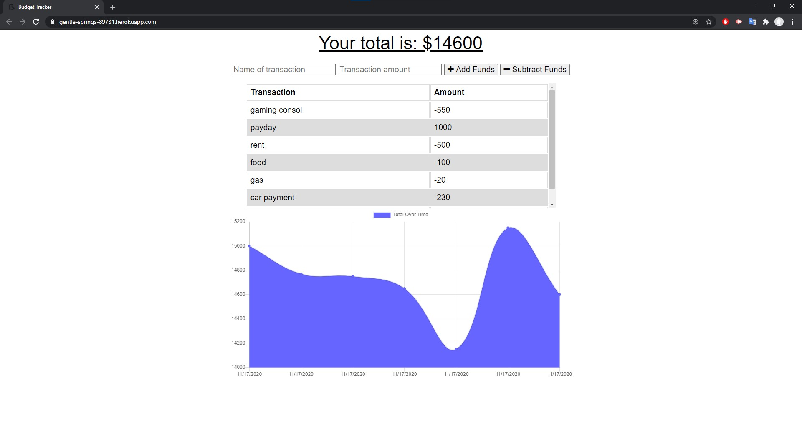
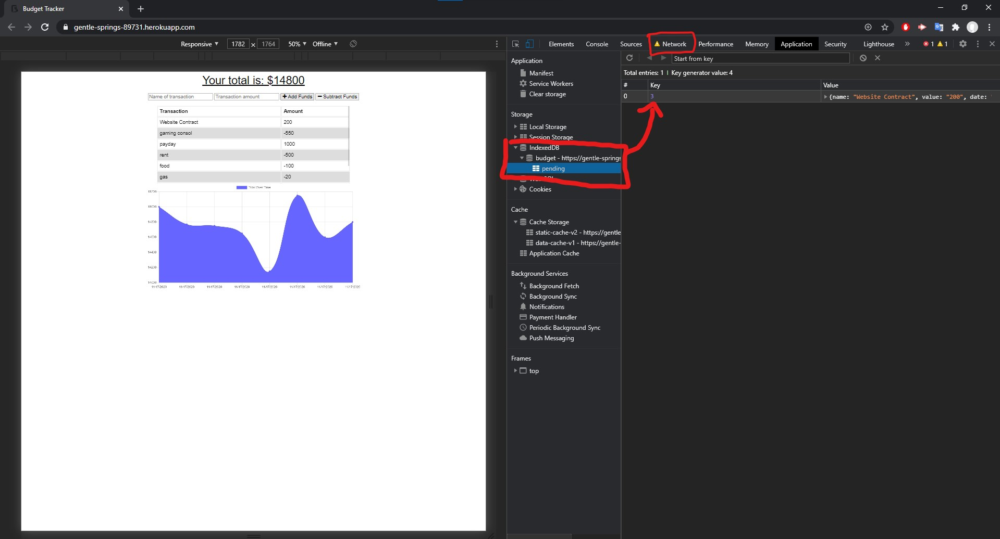

# Budget

## Description
This Progressive Web App (PWA) is a budget tracker that will allow users to be able to add expenses and deposits to their budget with or without a connection to the internet. When entering transactions offline, they will populate the total budget when able to connect online again.

## Table of Content

- [Description] (#description)
- [Installation](#installation)
- [Usage](#usage)
- [Author](#author)
- [Images](#images)
- [Demo](#demo)
- [Copyright](#copyright)

### Installation

No Installation required

### Usage

This application allows for the user to enter the name of the exspense and value they are either adding or subtracting from their budget total. If the user is offline, the app will store the data and populate on the graph once the user reconnects and is online once more.

### Live Webapp

Try it out for yourself at [Budget Tracker](https://gentle-springs-89731.herokuapp.com/)

### Licence

This project is licensed under the MIT- License

### Author

Zach Greenberg

### Images

### Demo

#### CopyRight

Copyright 2020 &copy; Zach Greenberg